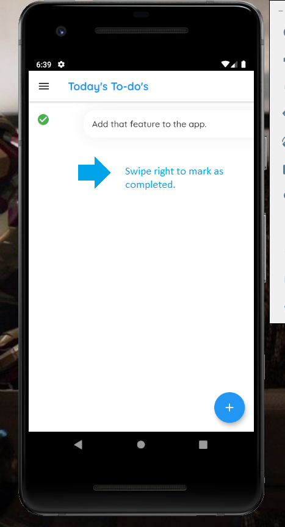

# todays_todos

An android app(using flutter framework) which helps you in managing your daily tasks.

## Screenshots

## Getting Started

How to use :- 
Swipe left -> to delete the todo 
Swipe right -> to mark todo as completed 
Tap on todo card -> to edit the current todo  

Data Storage :- 
This app uses SQLite to store data locally on your android device.
